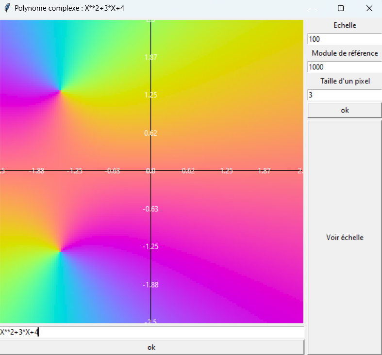

# Contexte
L'objectif de cette interface est de visualiser les polynômes dans le plan complexe. Pour celà on doit utiliser une échelle de couleur où chaque couleur correspond à un nombre complexe précis. Ainsi, comme dans l'exemple ci-dessous, il est possible de voir un polynôme X² + 3X + 4 et ses racines.

# Guide

L'interface est décomposée en trois parties :
- le canvas qui permet de visualiser les valeurs dans le plan complexe 
- le polynôme qu'on veut visualiser ci-dessous
- les paramètres d'échelle :
  - la précision de pixel du rendu, qui permet d'obtenir l'image
  - l'échelle x, qui permet de dézoomer/zoomer l'endroit du plan qu'on regarde.
  - le module de référence, qui permet de changer la sensibilité de la couleur à la module.
- le bouton "Voir échelle" permet de faire correspondre les couleurs avec leurs valeurs complexes.
